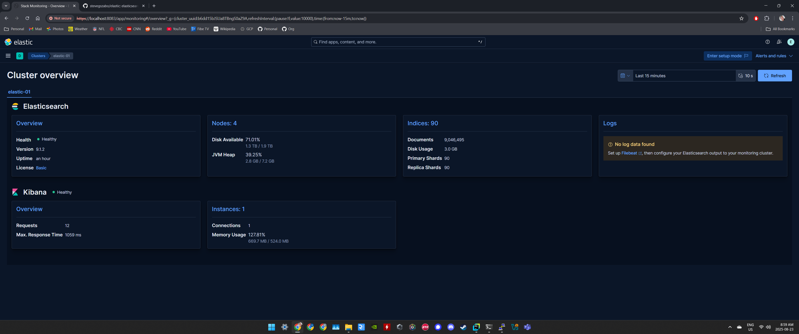
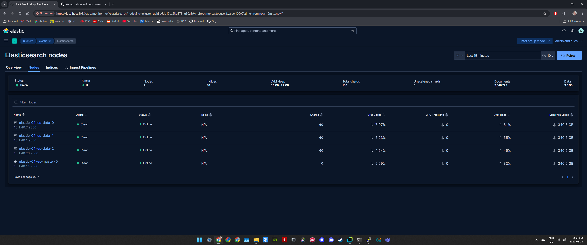
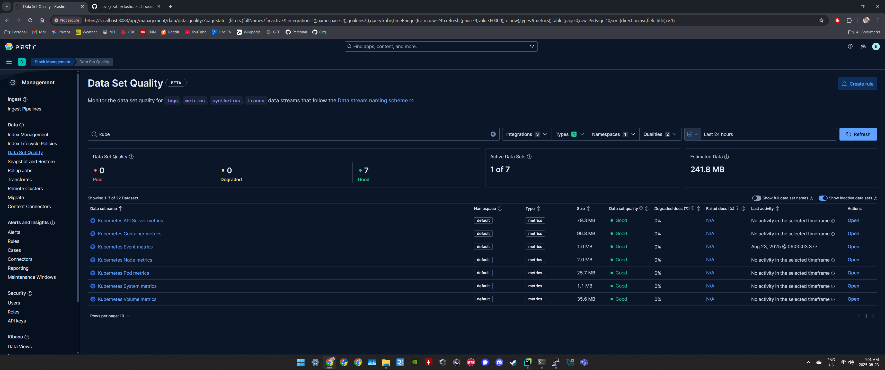
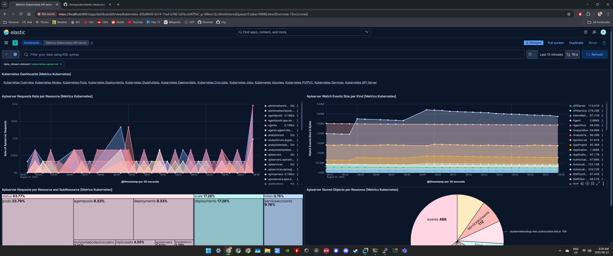
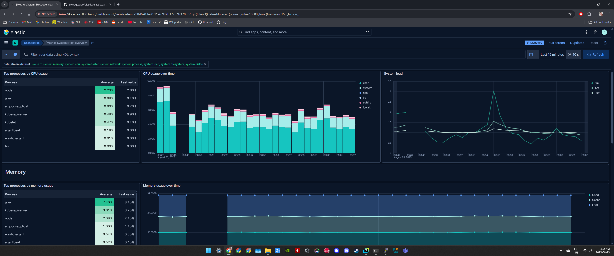

# elastic







```
ELASTIC_PASSWORD=$(kc -n elastic-01 get secret elastic-01-es-elastic-user -o json | jq -r .data.elastic | base64 -d)

kc -n elastic-01 port-forward svc/elastic-01-es-http 9200:9200

curl -v -k -u "elastic:$ELASTIC_PASSWORD" https://localhost:9200/
curl -v -k -u "elastic:$ELASTIC_PASSWORD" https://localhost:9200/_cluster/health?pretty | jq -r .
curl -v -k -u "elastic:$ELASTIC_PASSWORD" https://localhost:9200/_cat/nodes?v
curl -v -k -u "elastic:$ELASTIC_PASSWORD" https://localhost:9200/_cat/master?v

curl -v -k -u "elastic:$ELASTIC_PASSWORD" https://localhost:9200/_nodes/elastic-01-es-master-0 | jq -r .
curl -v -k -u "elastic:$ELASTIC_PASSWORD" https://localhost:9200/_nodes/elastic-01-es-master-1 | jq -r .
curl -v -k -u "elastic:$ELASTIC_PASSWORD" https://localhost:9200/_nodes/elastic-01-es-master-2 | jq -r .

curl -v -k -u "elastic:$ELASTIC_PASSWORD" https://localhost:9200/_nodes/elastic-01-es-data-0 | jq -r .
curl -v -k -u "elastic:$ELASTIC_PASSWORD" https://localhost:9200/_nodes/elastic-01-es-data-1 | jq -r .
curl -v -k -u "elastic:$ELASTIC_PASSWORD" https://localhost:9200/_nodes/elastic-01-es-data-2 | jq -r .

curl -v -k -u "elastic:$ELASTIC_PASSWORD" https://localhost:9200/_security/user | jq -r .
curl -v -k -u "elastic:$ELASTIC_PASSWORD" https://localhost:9200/_security/user/szabos | jq -r .

curl -v -k -u "elastic:$ELASTIC_PASSWORD" https://localhost:9200/.ds-metrics-generic-default-2025.08.17-000001/ | jq -r .
curl -v -k -u "elastic:$ELASTIC_PASSWORD" https://localhost:9200/.ds-metrics-generic-default-2025.08.17-000001/_search?q=monster | jq -r .
curl -v -k -u "elastic:$ELASTIC_PASSWORD" https://localhost:9200/.ds-metrics-generic-default-2025.08.17-000001/_search?q=monster | jq -r .hits.hits[0]
```
